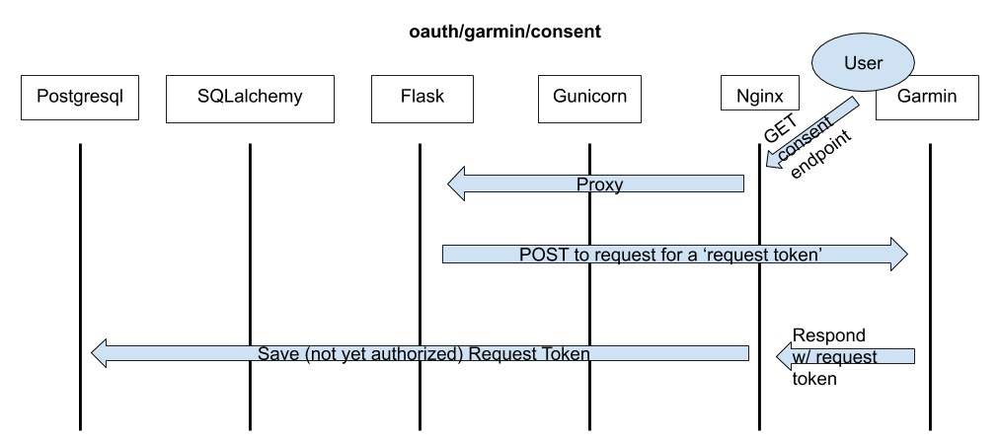

# apollo_flask
A  repo to build the OAuth and API website for the apollo project.

## Overview 

Apollo's main purpose is to obtain near-real-time data from wearable devices and combine it with self-reported and clinical data with the goal of subjecting it to machine-learning analysis. In order to obtain near-real-time data, we are integrating with providers of such data. Apollo-flask is the part of the project that manages the following:
 
 * Receiving permission from a data provided (e.g. Garmin or Google Fit) to utilize their API.
 * Provideing platform for our users to grant (and revoke) access to their data via the data provider.
 * Securely storing user credentials, authentication, and authorization data.
 * Receiving and securely storing user data as provided by the data provider.
 
At this time, Garmin Connect is the only data provider implemented.

### Technologies Used:
* Python 3
	* Flask (web framework)
	* Gunicorn (WSGI application server)
	* SQLalchemy (database interconnection library)
	* Pytest (Unit Testing)
	* rauth (Oauth client integration)
* Nginx (web server)
* Postgresql 11 (database server)

## Project Layout
### File Organization
The project is organized, at the top level, into the following directories:

* `apollo_flask`: containing the code needed to run the webserver.
* `nginx`: containing an nginx configuration file to setup the site.
* `tests`: containing unit tests.

In the top level directory, there are also some important files:
* `setup.*`: packaging files
* `wsgi.py`: The file to point gunicorn at.

The `apollo_flask` folder's `__init__.py` contains the code necessary to create the flask app and register blueprints to it, as well as set the application's environment (i.e., testing, development, or production) and load configuration dynamically. The `apollo_flask` folder also contains flask blueprints for handling oauth and the ingestion of data sent from the garmin health API.

Inside the `apollo_flask` folder, there exists a `db` folder, containing an `__init__.py` file that sets up context management for database queries (the `session_scope()` function) as well as flask commands to initialize the database. The `db` folder includes a `models` folder containing data models for user authentication and garmin wellness data, as well as library imports. 

#### Data Model
The database is broken into schemas handling user authentication and credentials (the `garmin_oauth` schema) and wellness data (the `garmin_wellness` schema). Thus, database queries need to be written with the schema name prepended; i.e.,

	SELECT * FROM garmin_wellness.daily_summary

The table schema for each of the database schemas is stored in a separate folder, with (generally) separate files for each table. Each file contains an import of the form
	
		from apollo_flask.db.models.lib import *
which imports various sqlalchemy data types and utilities, as well as declares some apollo_flask-unqiue data types. _If most data model classes will require a particular import, this is where it should be stored._

Generally, we try to centralize our object-relational mapping around the `garmin_oauth.user_id` table; both authentication data and currently implemented wellness data reference the `user_id.user_id` attribute as a foreign key, and sqlalchemy relationships exist between all relevant tables. This means that _most_ operations involving sqlalchemy should be able to query a user and retrieve all relevant data about that user without extra effort.

Class and attribute names are written in a style generally consistent with the rest of the Apollo project, __except__ the names of the API endpoints, which are named following the conventions set by Garmin exactly. Garmin itself uses a a fairly verbose (and fairly _undocumented_) CamelCase naming convention; thus, when renaming attributes in JSON responses to fit our data model, it is highly likely that some spelling errors will slip through. Be careful. 

If writing extra data models, be sure to add them to the appropriate
 `__init__.py` file so that they are imported with their package. In addition, 
if more schemas are added the `SCHEMA_LIST` variable in the
`apollo_flask/db/__init__.py` file must be updated.

### Authentication Flow
Authentication is done via OAuth 1 through the garmin health API. Full details are available via the specification available on the API website. The code handling consent, de-registration, and callbacks is in `apollo_flask/garmin_oauth.py`. Most of the nitty-gritty is handling by the `rauth` library. All authentication data, including access tokens, UIDs, request tokens, and active user booleans are stored in the `garmin_oauth` schema in the database. 

#### API Endpoints 

__oauth/garmin/consent:__

When an end user visits this endpoint (currently linked on the homepage as "Authorize Garmin Connect"), it triggers flask to ask for a request token from Garmin. When it receives one, it stores it in the database, and redirects the user to a consent page on the Garmin website along with the public half of the request token.

 
__oauth/garmin/callback:__

After a user has consented on the garmin website, they are redirected to this endpoint with an access token that allows us to access their data. This access token is stored in the database and the user is marked as active.

__oauth/garmin/deregistration:__

When a user wishes to revoke access, they must go to the Garmin Connect website and deregister our application. Garmin then POSTs a deregistration response to this endpoint to notify us that this has occured. Currently, this causes the application to mark the user as inactive in the database; in the future, we may require some additional handling.

### Data Ingestion Flow
The Garmin API offers two methods of sending data to clients: _push_ or _ping_. Currently, we use the _push_ method. 
When data is synced from a user's device to Garmin Connect, Garmin POSTs a request containing this data (in a JSON format) to our specified API endpoints. One or more data points (typically some form of "Wellness summary") is contained in each JSON object.

The currently-implemented Garmin API endpoints for `apollo_flask` all have the prefix `api_client/garmin/`.

When Flask recieves a request at this endpoint, it dispatches a method via the `garmin_api_client` blueprint. This method

 * Parses the request into the appropriate atomic parts (e.g., constructs a list of individual activity summaries)
 * For each atomic part, constructs a sqlalchemy object out of the JSON data
 * For each created object, compares it to the existing data in the database, and determines whether the incoming data creates a new record, updates an existing one, or is older than the existing data.
 * Returns a response to the garmin API upon success.

## Installation
Navigate to the project directory and run

    pip3 install -e .

to install the package in editable mode.
### Requirements
The project is written in python 3.6. Other versions of python will probably
work, but haven't been tested.
### Packages
Dependencies _should_ be installed automatically with the above command. If they
are not, the primary libraries you will need are sqlalchemy, rauth, flask,
requests, and pytest.
### Deployment

An ansible playbook/role is forthcoming, after it is decided how the database 
will be setup.

## Usage/Invocations
Once the web application is properly installed, nginx and gunicorn should be 
run as daemon processes. Project-specific invocations are given below.
### Flask
After setting the `FLASK_APP` environment variable to `wsgi:app` (or equivalent),
the database can be initialized with the following command

    flask init-db

### Gunicorn 

Gunicorn should be invoked as

    gunicorn --error-logfile FILE wsgi:app 

Gunicorn launches as a daemon process automatically; if you invoke (as above) in
an ssh session and put it as a background process, it will persist beyond the
session.

## Testing
A blank database, mock client, and a dummy UID (corresponding to the author) is 
loaded for many of the tests. The tests cannot (currently) be run in parallel; 
if the database is in use, sqlalchemy will not be able to re-initialize it 
before running the next test.

Testing configuration options and fixtures are declared in the
`tests/conftest.py` file.

The `test_garmin_api_client` suite could use some improvement. Currently, it 
tests for the presence of a handful of object attributes in the database, as 
well as for validity of assumptions about sqlalchemy, flask, and the garmin API.
This should be expanded with more robust (and perhaps dynamic) test data.

To run the entire testing suite, `cd` into the `apollo_site` directory and run
`pytest` or `python3 -m pytest`, depending on your environment. 

## Configuration
Configuration data for the flask app should be stored in a
`apollo_site/instance/config.py` file. A sample file is given below; the options
set are __required__.

    import os 
    GARMIN_CONSUMER_KEY = 'consumer_key' 
    GARMIN_CONSUMER_SECRET = 'consumer_secret' 
    os.environ['DATABASE_URI'] = 'postgresql://postgres@127.0.0.1:5432/apollo_site.db' 
    DEFAULT_DATABASE_URI = 'postgresql://postgres@127.0.0.1:5432/postgres' 
    DATABASE_NAME = 'apollo_site.db'
  
The `setup.py` and `setup.cfg` are configuration files for `setuptools` 
packaging and `pytest`, respectively.

### Web Application
By default, gunicorn listens on 127.0.01:8000, and is proxied via nginx.

	
### Database
#### Testing
The test suite constructs a new database from scratch for each test. This means 
that the tests (as currently written) cannot be run in parallel; if the database 
is in use, sqlalchemy will not be able to re-initialize it for the next test.

	
### Nginx
By default, nginx listens on port 443 (with plain HTTP redirected to 443), and
proxies to gunicorn on 127.0.0.1:8000.

