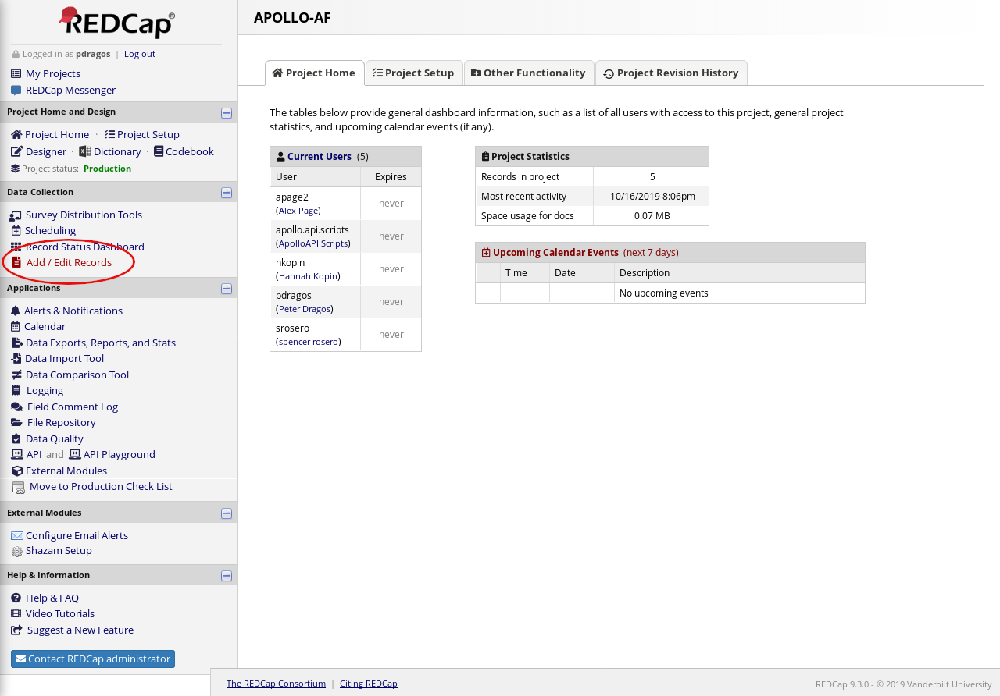
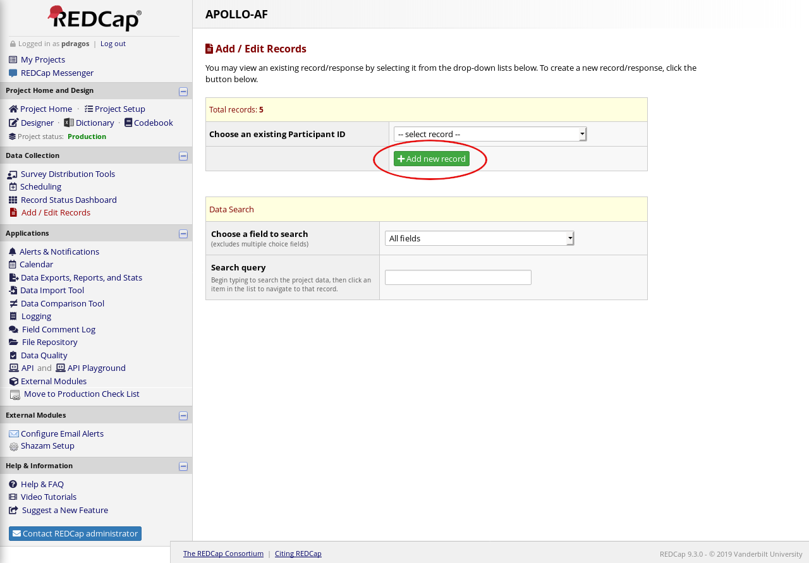
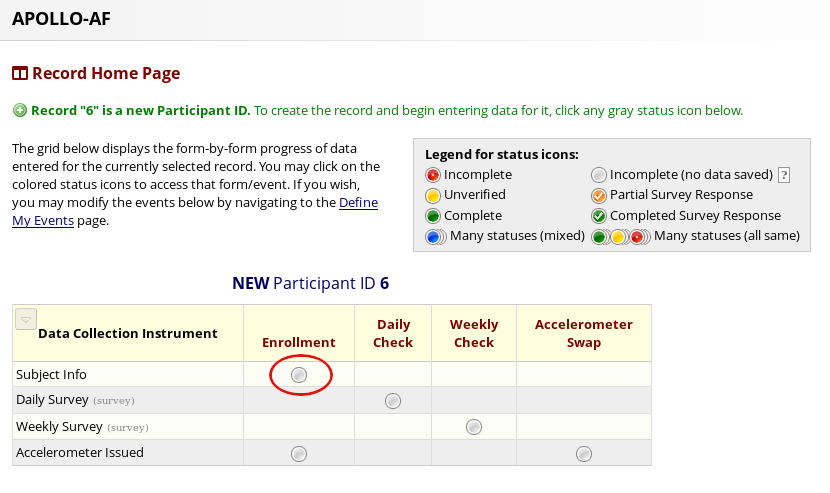
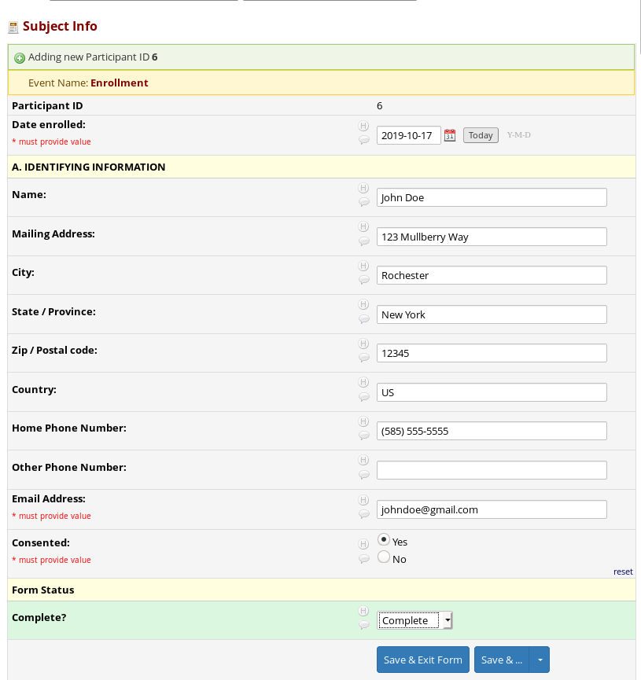
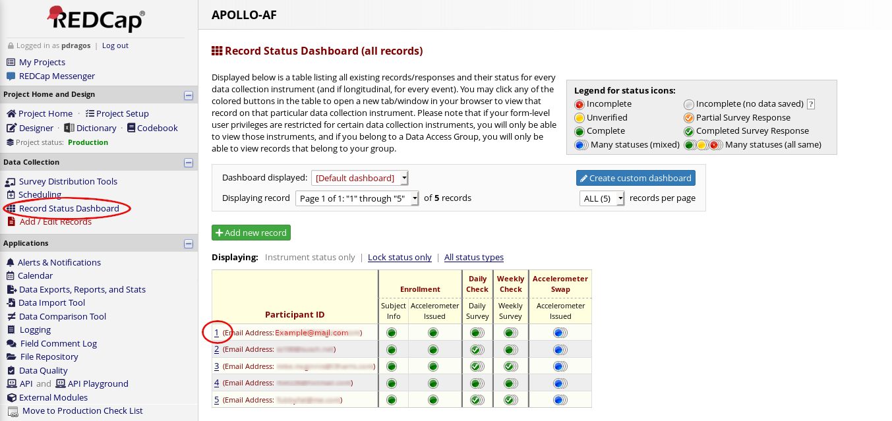
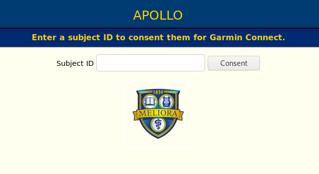

#TODO: Data Retention and Privacy Policy
#Study Coordinator Documentation

This documentation will guide you through enrolling a new subject into the Apollo-AF project. Briefly, you will need to:

* Enroll the subject in RedCAP.
* Create a Garmin Connect account for the subject.
* Authorize Apollo-AF to access the subject's data on Garmin Connect.
* Provide the subject relevant documents explaining our data retention and privacy policies.

---
##Step 1: Register the Subject in REDCap
[Click here](https://redcap.urmc.rochester.edu/redcap/) to go to the REDCap
website, or type the following URL in the address bar:

> https://redcap.urmc.rochester.edu/redcap/

Log-in using the dialog on the homepage. Under `My Projects`, click `APOLLO-AF.`

Select `Add / Edit Records` from the nagivation bar:

Click `Add new record`:

and select the `Enrollment` button:

and fill out the form presented.

At this point you should verify that the subject was added successfully. You will also need the Subject (participant) ID. Navigate to the `Record Status Dashboard` using the navigation bar on the left. Locate the `Participant ID` of the subject you just enrolled. _You will need this identifier later._

##Step 2: Register on Garmin Connect
The portal provided by Garmin to allow us access to subject's wearable data requires an account on [Garmin Connect](https://connect.garmin.com). Because we do not want subjects manually entering data or changing settings on the Garmin Connect website, you (the study coordinator) will register accounts on behalf of the subjects. You should use an email of the form

> subject_000@apollo-af.org

that is, the word "subject", followed by an underscore, followed by a three-digit form of the subject identifier from Step 1 (with leading zeros, if applicable). 

All emails sent to `apollo-af.org` are forwarded to a URMC-controlled email
address. You do not need to create an email address before using it to register
on Garmin Connect.

[Click here](https://connect.garmin.com/signin) to navigate to the Garmin Connect sign in page, or type the following URL in the address bar:
  
> https://connect.garmin.com/signin

Beneath the sign-in dialog, click the account creation link.

Complete the form, and click "Create Account." Please use a password manager to keep track of the passwords to individual accounts. __Do not reuse passwords between accounts.__

---
##Step 3: Authorize Apollo-AF

__Note: You may already be logged in to Garmin Connect from the prior step, or from other activities relating to this study. If you logged in to an account on Garmin Connect, you will _not_ see the account information displayed. Make sure you are enrolling the correct account into the correct study. If you are unsure, clear your browser's cache or conduct this step in a private browsing window. If you need assistance, please ask.__

[Click here](https://auth.apollo-af.org/oauth/garmin/consent) to navigate to the Apollo-AF consent page, or type the following URL in the address bar:

> https://auth.apollo-af.org/oauth/garmin/consent

Enter the Subject ID from step 1 when prompted:

If you are still logged in to Garmin Connect from the previous step, will be automatically presented with the agreement form. If not, you will be prompted to enter the credentials for the account you created in step 2.

Next, agree to the prompt.

You will be redirected to `auth.apollo-af.org`, and should see a message reading

> You have successfully authorized us to monitor your Garmin data.

__If you do not see this message, something has gone wrong. Please notify us at [apollo-af@urmc.rochester.edu](mailto:apollo-af@urmc.rochester.edu).__

##Step 4: Data Retention and Privacy Policy
__To do__
