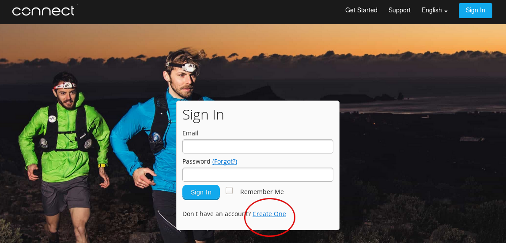
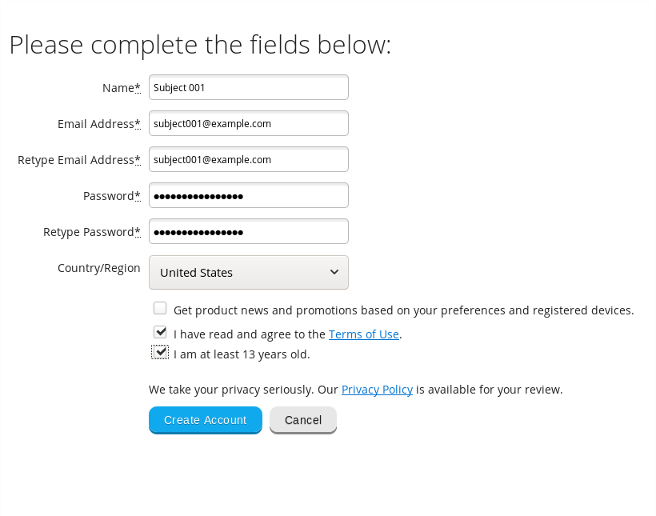
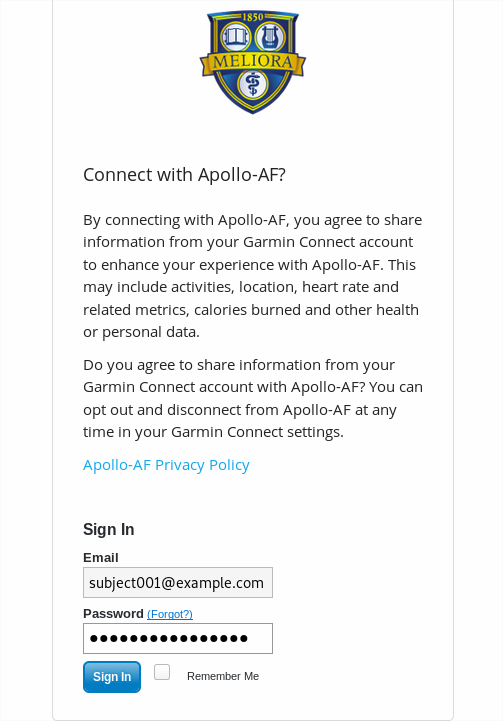
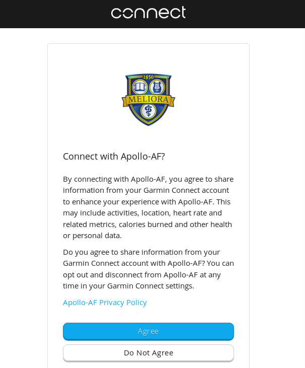

#_TODO: Finish steps 1, 4, and 5_

#Study Coordinator Documentation

This documentation will guide you through enrolling a new subject into the Apollo-AF project. Briefly, you will need to:

* Create a _URMC-monitored_ email address for the subject.
* Create a Garmin Connect account using this email.
* Authorize Apollo-AF to access the subject's data on Garmin Connect.
* Enroll the subject in the recurring RedCAP surveys using _their_ email address.
* Provide the subject relevant documents explaining our data retention and privacy policies.
---
##Step 1: Create an email address
The portal provided by Garmin to allow us access to subject's wearable data requires an account on [Garmin Connect](https://connect.garmin.com). Because we do not want subjects manually entering data or changing settings on the Garmin Connect website, you must create an email address for each subject and register an account on Garmin Connect.

---
##Step 2: Register on Garmin Connect

[Click here](https://connect.garmin.com/signin) to navigate to the Garmin Connect sign in page, or type the following URL in the address bar:
  
> https://connect.garmin.com/signin

Beneath the sign-in dialog, click the account creation link.

Complete the form, and click "Create Account." Please use a password manager to keep track of the passwords to individual accounts. __Do not reuse passwords between accounts.__

---
##Step 3: Authorize Apollo-AF

__Note: You may already be logged in to Garmin Connect from the prior step, or from other activities relating to this study. If you logged in to an account on Garmin Connect, you will _not_ see the account information displayed. Make sure you are enrolling the correct account into the correct study. If you are unsure, clear your browser's cache or conduct this step in a private browsing window. If you need assistance, please ask.__

[Click here](https://auth.apollo-af.org/oauth/garmin/consent) to navigate to the Apollo-AF consent page, or type the following URL in the address bar:

> https://auth.apollo-af.org/oauth/garmin/consent

If you are still logged in to Garmin Connect from the previous step, will be automatically presented with the agreement form. If not, you will be prompted to enter the credentials for the account you created in step 2.

Next, agree to the prompt.

You will be redirected to `auth.apollo-af.org`, and should see a message reading

> You have successfully authorized us to monitor your Garmin data.

__If you do not see this message, something has gone wrong. Please notify us at [apollo-af@urmc.rochester.edu](mailto:apollo-af@urmc.rochester.edu).__
